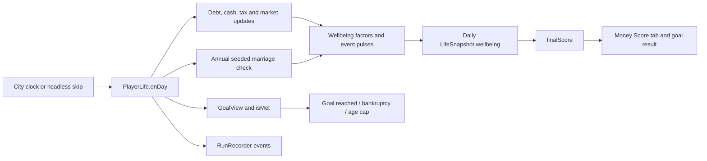

# Life goals and wellbeing integration

Implemented from [`lastengine.md`](../lastengine.md) and the adopted model in [`research/09`](../research/09-wellbeing-meter.md). Both engines run locally from the same `PlayerLife` used by the city, Money desk and headless skips. They require no service, API key, migration or additional dependency.

## Frontend contracts

```ts
import { wellbeing, finalScore } from "../sim/wellbeing/index.ts";
import { viewOf, isMet, priceTag, runSkip } from "../sim/skip/index.ts";

const meter = wellbeing(life, life.today); // { W, factors }
const score = finalScore(life, life.today); // { RR, Wlife, final }
const goal = { kind: "status", annualIncome: 100_000 } as const;
const view = viewOf(life);
const reached = isMet(goal, view);
const hint = priceTag(goal, view, life.place.name); // { text, progress }
```

Each factor exposes a stable `name`, `weight`, normalized `s`, earned `points` and explanatory `note`. Render these values; avoid reimplementing the arithmetic in UI components. Scores are 0–100 and rounded to one decimal. `LifeSnapshot.score` remains the **credit score**; `LifeSnapshot.wellbeing` is the new daily meter. `finalScore()` reads the current branch's history and returns 60% retirement readiness plus 40% lifetime wellbeing. Lifetime wellbeing is half the average recorded daily meter and half the live meter.

Use the current life and day when requesting live scores. Passing a past date with today's state does not reconstruct the past. Read the saved `LifeSnapshot.wellbeing` for historical charts; reconstruct a life from the same seed and decisions for a different branch. The new scoring functions do not implement calendar rewind or persistent replay themselves.

Goals remain the existing discriminated union. `net_worth` is shown as “Build your life savings,” and counts invested brokerage positions as well as account balances. `marriage` checks `relationship === "partnered"`; its unfinished progress is `null`, so render explanatory text rather than a percentage. `status` checks gross annual income against `annualIncome`. The current engine has no autonomous raises or promotion simulation: a higher target needs a future career system to update income.

The market preview exposes `goalTiming`: `modeled`, `relationship_unsupported`, or `income_static`. Check this before presenting reach counts as a probability or a date. Its financial chart remains usable for every goal. Marriage luck belongs to the daily life engine and is not forecast by the market scenarios.

## Flow between engines



Marriage uses the market seed with its own `marriage` random stream and calendar year, checked on January 1. Money choices do not consume or shift that stream. Its event and positive pulse are applied before the day's snapshot and emitted through the existing recorder. `setEmployed()` records the job transition and layoff/re-employment effects; `PlayerLife.fileBankruptcy()` wraps the debt engine so a real filing records its pulse and event. Frontends should use that wrapper rather than call the lower-level debt function directly.

`RunRecorder` sends marriage through the existing event endpoint, retaining event keys on retries. Wellbeing history and final scores remain client-side, per scope; loading the server's financial history alone does not restore a complete scored life. News ranking for marriage, generated divorce/children/layoffs, insurance shopping and geographic commute simulation remain separate future work.

## Research and gameplay assumptions

The nine weights are the approved game design: Work 20, Cash cushion 18, Debt load 14, Real income 12, Relationships 10, Retirement on track 8, Health coverage 8, Commute 6 and Home stability 4. The research supports the factors and relative effects; it does **not** validate this exact combined game score as a scientific instrument.

- The [CFPB's September 2017 report](https://www.consumerfinance.gov/archive/newsroom/cfpbs-first-national-survey-financial-well-being-shows-more-40-percent-us-adults-struggle-make-ends-meet/) reports an average of 54 from its 2016 survey and ten-question instrument. The Score tab labels this as historical context, not a directly comparable score calculated by that instrument.
- The retirement age milestones follow the adopted [Fidelity savings guideline](https://www.fidelity.com/viewpoints/retirement/retirement-guidelines): 1× salary at 30, 3× at 40, 6× at 50, 8× at 60 and 10× at 67. Interpolation and the 50/20/15/15 retirement-readiness formula are game rules.
- The fixed 23-minute commute is inspired by the German SOEP sample in [Stutzer and Frey's commuting paper](https://docs.iza.org/dp1278.pdf), not a measured US average. Employment stands in for insurance coverage until insurance choices exist.
- The 8% annual marriage chance is an **uncalibrated gameplay placeholder**, not a published demographic rate. Marriage is never guaranteed.
- Bankruptcy affects the wellbeing debt factor for two years; this is separate from the debt engine's longer credit-report effects. Pulse half-lives are the adopted game calibration, and only negative pulses receive the cash-cushion multiplier.
- Housing stability currently uses the existing home tier. The engine has no foreclosure/eviction event to model an additional year of housing-loss effects.

## Validation and cost

Run `npm test` and `npm run build` from `game/`. The test script enumerates `tests/*.test.ts`, which works with the repository's native Node TypeScript test runner. Cross-engine tests in `game/tests/engine-flow.test.ts` compare daily play with goal fast-forward, replay different money choices under the same marriage luck, and exercise event delivery retries. The server's snapshot-route tests check that marriage fits the existing event schema.

Integration verification: **243 game tests passed**, the **5 server snapshot/event-schema tests passed**, and the production TypeScript/Vite build passed. Vite still reports its pre-existing warning for bundles above 500 kB. Independent architecture review and its follow-up found no unresolved issues; regression tests cover same-day history refresh after moving, spending and auto-filing taxes.

Daily wellbeing computation reads current accounts, debts and pulses; it does not scan daily history or call `snapshot()` recursively. The annual marriage roll runs once per eligible year. `finalScore()` scans the recorded daily history only when requested, so a daily tick does not add quadratic history work. Keep lifetime-score requests out of animation-frame loops; refresh when the life changes.

A local Node 24 benchmark of 14,610 headless days (40 years; seed 5, debt-free Texas household, $100k gross salary) took 39/27/27 ms across three warm runs with scoring enabled, versus 18/16/13 ms before this change. A final-score request over its 14,611 daily rows averaged 0.13 ms across 100 calls. These are a small synthetic fixture on one developer machine, not a browser-wide performance guarantee.

A headless Chromium smoke check exercised the real Money desk Score tab (all nine factor rows), all six goal choices, both special preview timing messages, and a marriage fast-forward ending on day 112 with its combined score visible. It reported no page exceptions.
