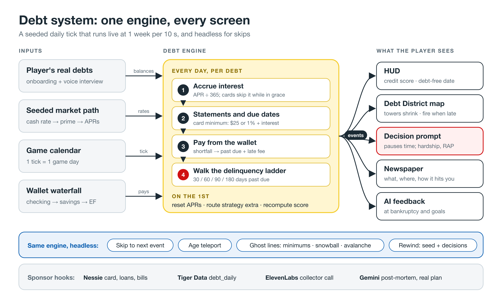
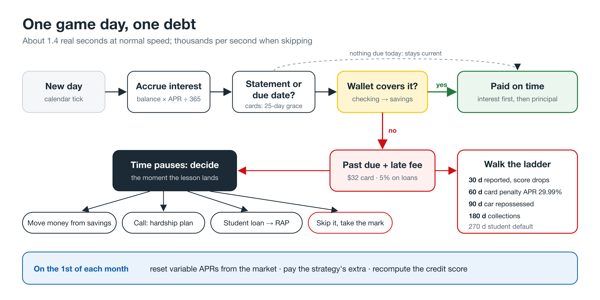
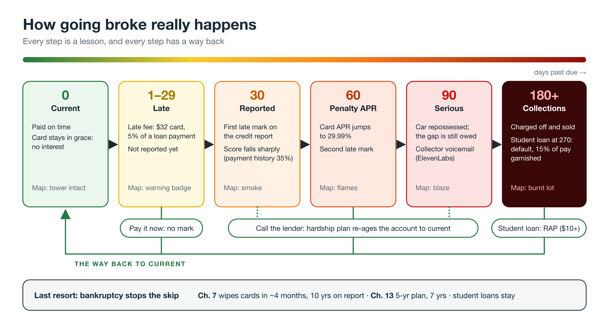
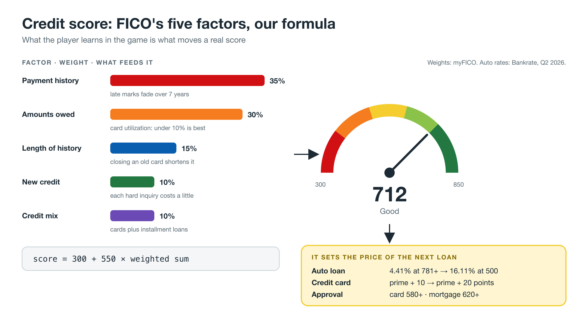
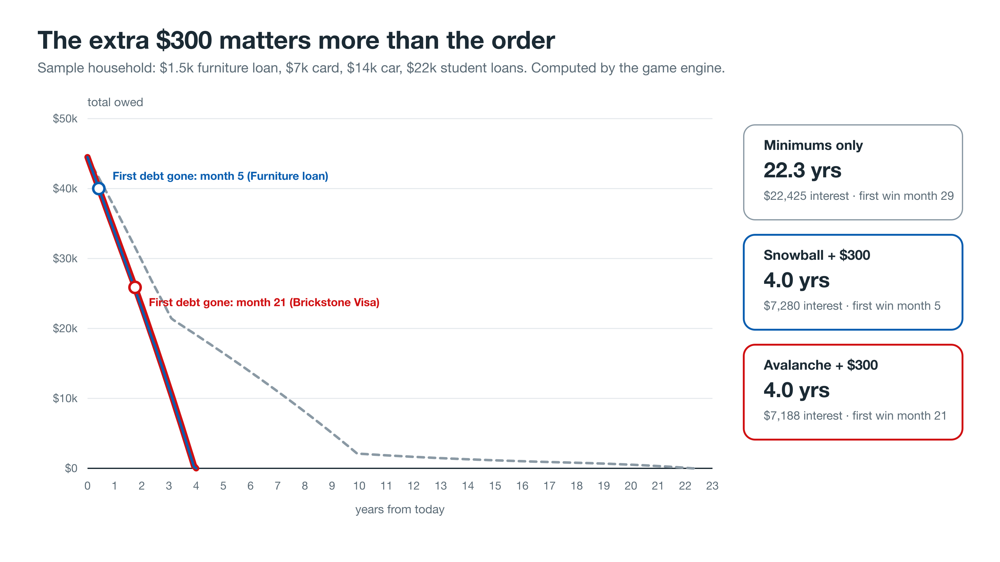

# Larp City - Debt System Design

How the debt system from [06-debt-and-credit.md](06-debt-and-credit.md) is built in the game.
Written 2026-09-11 during HackRice 2026.
Code: `game/src/sim/debt/` (engine), `game/src/debt-demo/` (Credit Desk page), `game/tests/debt.test.ts` and `life.test.ts` (24 tests), `game/scripts/debt-charts.ts` (pitch chart).
Diagrams for the pitch deck: [../diagrams/debt/](../diagrams/debt/) (SVG source plus 3200 px PNG exports).
Mirrored to Notion on 2026-09-11 as the "🛠️ Research: Debt System Design" sub-page (with all five diagrams), plus a "Built on Sep 11" block and the architecture diagram in the "💳 Debt & Credit" section.

## TL;DR

- One pure TypeScript engine, `tickDay(book, ctx)`, runs once per game day.
  The live calendar calls it at 1 in-game week per 10 s, and skips, goal fast-forwards, and the ghost lines call the same function headless, so every number the player sees comes from one code path.
- Inputs are the player's debts, the market's cash rate (seeded and decision-independent), the calendar date, and a `Wallet` (the game's shortfall waterfall).
- Output is a list of typed events (`payment`, `missed`, `late_mark`, `penalty_apr`, `repossessed`, `collections`, `default`, `paid_off`, `cannot_cover`, `bankruptcy_eligible`, `score_change`) that the HUD, map, decision prompts, newspaper, and AI feedback subscribe to.
- It is deterministic: the same book, dates, and wallet produce identical events (tested), which keeps rewind exact.
- Play it: `cd game && npm run dev`, then open `/debt.html` (the Credit Desk).
- Test it: `npm test` (Node's built-in runner, no new dependencies).

## Files

| File | What it does |
| --- | --- |
| `types.ts` | `Debt`, `DebtBook`, `CreditProfile`, `Wallet`, `RateEnv`, and the `DebtEvent` union |
| `rates.ts` | 2026 constants and `offeredApr(kind, score, cashRate)`: prime = cash + 3, card = prime + 10 to 20 points by score, auto 4.41% to 16.11%, mortgage = cash + 2.46 + up to 1.5 |
| `math.ts` | Amortized payment, card minimum ($25 or 1% plus interest), RAP payment, Standard plan term |
| `score.ts` | The five-factor score (300-850) and its breakdown for the credit report UI |
| `engine.ts` | `tickDay`, the delinquency ladder, and the recovery actions (`enrollHardship`, `switchToRap`, `payNow`, `garnishmentRate`) |
| `strategy.ts` | `orderByStrategy`, `project` (monthly projection), `compareStrategies`, `cardPayoff` |
| `bankruptcy.ts` | Means test, `fileBankruptcy(book, 7 or 13, day)` |
| `factory.ts` | `creditCard`, `installment`, `studentLoan`, `newBook`, `sampleHousehold` |
| `index.ts` | Public exports |

## The daily tick

For each open debt, in order:

1. **Accrue** simple daily interest: `balance × APR ÷ 365`.
   A card that was paid in full last cycle is in its grace period and accrues nothing.
   The APR in effect is the hardship APR if one is active, else the penalty APR if triggered (which cancels any promo), else an intro or balance-transfer promo APR until it expires (`promoApr` / `promoUntil`, added for the balance transfer event), else the contract APR.
2. **Statements and due dates.**
   Cards close a statement on their cycle day: accrued interest is added to the balance, the minimum is set, and the payment is due 25 days later (the CARD Act requires at least 21).
   Installment and student loans fall due on their day of the month.
3. **Pay** through the `Wallet`, interest first, then principal.
   RAP loans waive the interest a payment doesn't cover, and principal always falls by at least the smaller of $50 or the payment.
   If the wallet can't cover the required amount, the shortfall becomes `pastDue`, a late fee is added ($32 on cards, 5% of the payment on loans, none on federal student loans), and a `cannot_cover` event fires so the game can pause for a decision.
4. **Walk the ladder** by days past due (next section).

Then on the 1st of each month: variable APRs reset to prime plus their margin, the strategy's extra money (plus the "snowball" rollover of paid-off payments) goes to the first debt in strategy order, the score is recomputed, and the bankruptcy check runs.

## The delinquency ladder

| Days past due | Engine effect |
| --- | --- |
| 1-29 | Status `late`; fee already charged |
| 30, 60, 90, 120 | A late mark of that severity is reported once per episode; the score is recomputed and the event carries before and after |
| 60 (cards) | Penalty APR, at least 29.99% |
| 90 | Status `serious`; an auto loan is repossessed, leaving 35% of the balance as a deficiency in collections |
| 180 (unsecured) | Charged off to `collections`; added to the credit profile |
| 270 (federal student) | `default`; `garnishmentRate(book)` returns 0.15 until the player switches to RAP |

Ways back: pay the past-due amount (the episode resets and no further marks are reported), `enrollHardship` (9% APR for 180 days and the account is re-aged to current), or `switchToRap` for student loans (which also cures a default in the game).

Bankruptcy becomes an option (`bankruptcy_eligible`, at most once every 90 days) when unsecured debt is 90+ days late and the minimums exceed half of take-home pay.
Chapter 7 discharges unsecured debt except federal student loans, costs $338 plus about $1,500, and caps the payment-history factor for 10 years.
Chapter 13 turns 40% of it plus the attorney fee into a 60-month 0% plan and lasts 7 years.

## The credit score

`score = round(300 + 550 × weighted sum)`, with FICO's weights: payment history 35%, amounts owed 30%, length of history 15%, new credit 10%, credit mix 10%.
Late marks cost 0.15 to 0.5 of the payment factor and fade linearly over 7 years; utilization is piecewise (1.0 under 10%, 0.85 at 30%, 0.5 at 50%, 0.2 at 90%+).
A new player with no history lands in the 600s, and the sample household starts at 665.
The score feeds `offeredApr`, so a missed payment today raises the price of the next car.

## Strategies and projections

`project(debts, strategy, extra)` runs month by month with the real card minimum, and pays `extra` plus every freed-up payment to the target debt.
It powers the payment slider's debt-free date, the ghost lines, and the goal fast-forward's debt input.
For the sample household ($44,500 across four debts, $300 extra): minimums take 22.3 years and $22,425 of interest; snowball and avalanche both take 4.0 years, at $7,280 and $7,188, and snowball clears its first debt at month 5 versus 21.

## Wired into the city scene (`src/sim/life/`)

Done on 2026-09-11: `PlayerLife` (`src/sim/life/player.ts`) owns the player's money life, and `src/main.ts` runs it once per game day.

- **Accounts:** the other money session's `Ledger` (`src/sim/money/accounts.ts`): checking, high-yield savings (4% APY), emergency fund, and brokerage.
  `ledger.wallet()` is the debt engine's `Wallet`, so payments drain checking, then savings, then the emergency fund, never investments.
- **Each day:** settle pending transfers; paychecks on the 1st and 15th (40% while unemployed, minus any garnishment); rent on the 1st and living costs on the 15th, scaled to the current state (national median rent $1,487 × the state's housing price parity, $950 × its goods parity); then `tickDay`; then savings interest on the 1st.
- **Rates:** the engine's cash rate is the real effective Fed funds rate from the FRED snapshot (`src/sim/life/rates.ts`, 3.63% on 2026-09-10), held at the last value past the snapshot until the seeded market path drives it.
- **City hooks in `main.ts`:** `clock.onDay` calls `player.onDay`; a `bankruptcy_eligible` event stops the skip time-lapse and pauses time; the hero's home tier follows `player.homeTier()` (tent after bankruptcy or collections, then studio, small house, townhouse, large house, villa at $25k / $100k / $250k / $1M of net worth); moving states calls `player.setPlace` so rent changes; `window.larp.player` exposes it for the console.
- **Headless:** `player.runHeadless(fromDay, days, startDate)` runs skips (and will run goal fast-forwards) and stops at bankruptcy.
- **Not yet in the city UI:** the HUD numbers and the Debt District on the map. Decision prompts are built: since 2026-09-12 the city checks `player.needsDecision(events)` each day and opens the Money desk on a payment it can't cover, bankruptcy, or a bear market.
- **Persistence (Tiger Data, planned):** one `debt_daily` row per debt per day and a `credit_score_monthly` row on the 1st.
- **Nessie (unverified):** mirror cards as `Credit Card` accounts and loans as Nessie loans behind an adapter with a mock.

## Credit Desk (`/debt.html`), now the Money desk

Since 2026-09-12 this page is the Money desk (the redesign from [research 12](12-credit-desk-ui.md)): Home, Cash, Investing, Debt, Credit, and Cards in a Robinhood-style layout, sharing the city's `PlayerLife` and clock when opened from the phone; [game/README.md](../game/README.md) describes it as it is now.
The rest of this section records the Sep 11 terminal design.

Redesigned on 2026-09-11 from the LEGO-style Debt Lab into a markets terminal, first dark, then (at Cayden's request) restyled to match the city game: Fredoka, a sky ground, blue HUD cards with white borders, yellow buttons, and charts on white insets. It runs the same `PlayerLife` as the city on the game's real `Clock`.
In the city it opens from the player's phone (`src/ui/phone.ts`): the phone docks on the left edge as the hub for the game's apps, with a Stocks app (FRED watchlist with sparklines, plus live quotes when a key is set) whose "Open Credit Desk" button shows `/debt.html` in a window over the city and pauses city time; News, Mail, and Bank are placeholders marked "Soon".
At the time the Credit Desk window ran its own `PlayerLife`; it has shared the city's player (through `window.larpMoney`) since Sep 12, and the phone now pulls up from the bottom-right.

- **Top bar:** speed (pause, 1×, 2×, 4×), skips (+1 week, month, year), the game date, and the data source badge (FRED snapshot, or "Live · Alpha Vantage").
- **Ticker tape:** S&P 500, Nasdaq, Dow, Fed funds, 10-year Treasury, and 30-year mortgage from FRED with day changes; live SPY, QQQ, DIA, and IWM quotes join it when a key is set.
- **KPIs:** net worth (and change this run), cash (with the state's rent), total debt, credit score with its band, debt-free date, and debt-to-income.
- **Chart (hover crosshair and tooltip):** debt payoff under minimums, snowball, and avalanche; net worth, debt, and cash history; the S&P 500 (or SPY daily when live); and the three rates.
- **Liabilities table:** balance with paid-down bar, APR in effect, minimum, next due date, status chip, a "Pay $100" button, and a totals row with the balance-weighted APR.
- **Payoff strategy:** strategy toggle, extra-per-month slider, and the three strategies' time, interest, and first-win month.
- **Rates:** Fed funds, prime, the player's card APR, the score-priced auto offer, the 30-year mortgage, and the 10-year Treasury, plus a "Rate shock" button (+1 point).
- **Credit report, activity feed, and scenarios** (layoff, move to another state, reset).
- When a payment can't be covered from checking, savings, and the emergency fund together, time pauses for a decision: a hardship plan, RAP for student loans, or letting it slide, each with a one-line lesson; bankruptcy offers Chapter 7, Chapter 13, or keep paying.

## Market data

- **Snapshot (always on):** `npm run market:snapshot` pulls a year of `SP500`, `NASDAQCOM`, `DJIA`, `DFF`, `DGS10`, and `MORTGAGE30US` from FRED's keyless CSV export into `src/data/market.ts`, so the game never depends on a live API.
- **Live quotes (optional):** `vite.config.ts` adds `/api/market/status`, `/api/market/quotes?symbols=`, and `/api/market/daily?symbol=` to the dev and preview servers.
  They call Alpha Vantage (`GLOBAL_QUOTE`, `TIME_SERIES_DAILY` compact) with `ALPHAVANTAGE_API_KEY` from `game/.env.local` or the repo-root `.env` (the key never reaches the browser), and cache responses in `game/.cache/market/` (quotes 6 hours, daily bars 24 hours) because the free tier allows 25 requests a day.
  Without a key they return 503 and the pages use the snapshot.
- **Production:** the Express server (`server/`, live since Sep 12) doesn't host these three routes yet, so the deployed game uses the snapshot; porting them is the fix.

## Simplifications (on purpose)

- One balance per card (no separate purchase, cash advance, or promo balances).
- Late fees are flat; real issuers vary and many kept lower fees after the CFPB's $8 cap was vacated.
- The means test approximates the state median from the national ACS median times the state's price parity until `states.json` carries ACS medians.
- Mortgages, BNPL, payday loans, and medical bills have types and rates but no events yet.

## Next steps

1. Wire `tickDay` into the city scene's `Clock.onDay` and the player's account waterfall.
2. Render the Debt District towers with the procedural brick code in `engine/bricks.ts`.
3. Add events D2-D15 from doc 06 (card offers, BNPL, payday storefront, car and house purchases, refinancing, balance transfers, co-signing).
4. Stream `debt_daily` to Tiger Data and mirror to Nessie.

## Sources added for the build

- 2026-27 federal Direct undergraduate rate of 6.52% ([FSA Partners](https://fsapartners.ed.gov/knowledge-center/library/electronic-announcements/2026-06-04/interest-rates-federal-direct-loans-first-disbursed-between-july-1-2026-and-june-30-2027)).
- Average daily balance and the CARD Act's 21-day minimum grace period ([CFPB](https://www.consumerfinance.gov/ask-cfpb/how-does-my-credit-card-company-calculate-the-amount-of-interest-i-owe-en-51/), [Debt.org](https://www.debt.org/credit/cards/interest/)).
- The CFPB's $8 late fee cap was vacated in April 2025; the typical fee before it was $32 ([ABA Banking Journal](https://bankingjournal.aba.com/2025/04/cfpb-to-vacate-credit-card-late-fee-rule-in-deal-with-banks/), [CFPB](https://www.consumerfinance.gov/about-us/newsroom/cfpb-bans-excessive-credit-card-late-fees-lowers-typical-fee-from-32-to-8/)).
- All other figures are sourced in [06-debt-and-credit.md](06-debt-and-credit.md).
